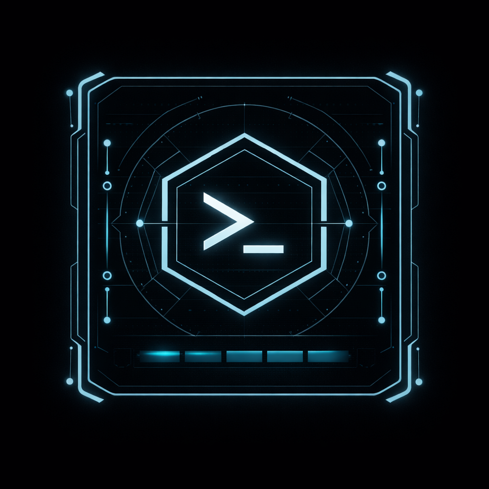
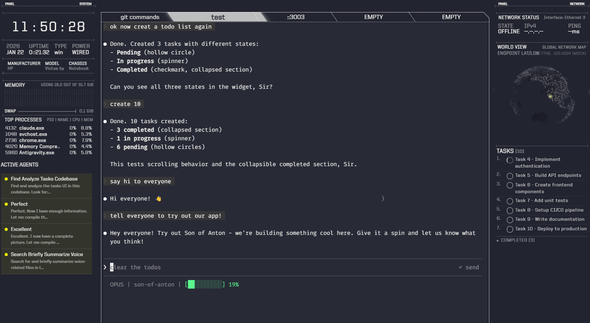

<p align="center">
  <br>
  
  <br><br>
  <a href="https://github.com/yifu001/son-of-anton/releases/latest"></a>
  <a href="https://github.com/yifu001/son-of-anton/blob/master/LICENSE"></a>
</p>

# Son of Anton

A sci-fi terminal emulator and Claude Code command center. Monitor your AI coding sessions in a TRON-inspired interface.

> Fork of [eDEX-UI v2.2.8](https://github.com/GitSquared/edex-ui)



---

## Features

### Claude Code Integration

Run Claude Code inside Son of Anton and get real-time visibility into your AI coding sessions:

- **Context Tracking** - Live display of token usage and context consumption
- **Active Agents Panel** - Monitor spawned subagents, their status, and descriptions
- **Todo Widget** - View tasks Claude is tracking during the session
- **Session State** - See current working directory, conversation state, and activity

The integration works automatically by parsing Claude Code's terminal output - no API keys or configuration required.

### Terminal Emulator

- Multi-tab terminal with full color and mouse support
- Works with bash, zsh, PowerShell, cmd, and curses applications
- Sci-fi sound effects for typing, commands, and events
- Directory browser that follows terminal's current working directory

### System Monitoring

- **CPU** - Real-time usage graphs and per-core breakdown
- **RAM** - Memory and swap usage visualization
- **Network** - Active connections, bandwidth, and GeoIP location globe
- **Processes** - Top processes by CPU/memory usage

### Customization

- 10 built-in themes (Tron, Blade, Matrix, Nord, etc.)
- On-screen keyboard for touch displays
- Configurable keyboard layouts
- CSS injection for advanced styling

---

## Quick Start

### 1. Download

Download the latest installer for your platform from [Releases](https://github.com/yifu001/son-of-anton/releases):

| Platform | File |
|----------|------|
| Windows (64-bit) | `Son of Anton-Windows-x64.exe` |
| Windows (32-bit) | `Son of Anton-Windows-ia32.exe` |
| macOS | `Son of Anton-macOS.dmg` |
| Linux | `Son of Anton-Linux.AppImage` |

### 2. Install & Run

**Windows:**
1. Run the `.exe` installer
2. Launch "Son of Anton" from Start Menu or Desktop

**macOS:**
1. Open the `.dmg` file
2. Drag to Applications folder
3. Launch from Applications

**Linux:**
1. Make AppImage executable: `chmod +x Son-of-Anton-*.AppImage`
2. Run: `./Son-of-Anton-*.AppImage`

### 3. Use with Claude Code

1. Open Son of Anton
2. In the terminal, run `claude` to start Claude Code
3. The side panels will automatically display Claude's context, agents, and todos

---

## Configuration

Configuration files are stored in:
- **Windows:** `%APPDATA%\Son of Anton\`
- **macOS:** `~/Library/Application Support/Son of Anton/`
- **Linux:** `~/.config/Son of Anton/`

### Themes

Change themes from the settings panel or edit `settings.json`:

```json
{
  "theme": "tron"
}
```

Available themes: `tron`, `blade`, `matrix`, `nord`, `navy`, `red`, `apollo`, `cyborg`, `interstellar`, `chalkboard`

---

## Keyboard Shortcuts

| Action | Shortcut |
|--------|----------|
| Toggle Fullscreen | `F11` |
| New Terminal Tab | `Ctrl+Shift+T` |
| Close Tab | `Ctrl+Shift+W` |
| Next Tab | `Ctrl+Tab` |
| Copy | `Ctrl+Shift+C` |
| Paste | `Ctrl+Shift+V` |

---

## Troubleshooting

### App won't start
- Ensure you have the correct version for your OS architecture
- Try running as Administrator (Windows) or with sudo (Linux)

### Terminal shows wrong shell
Edit `settings.json` and set your preferred shell:
```json
{
  "shell": "powershell.exe"
}
```

### File browser shows "Tracking Failed" (Windows)
This is expected. Windows doesn't support terminal CWD tracking. The file browser works in "detached" mode.

### Display issues on HiDPI screens
Launch with `--force-device-scale-factor=1` flag.

---

## Credits

- **Son of Anton** - Fork by [yifu001](https://github.com/yifu001)
- **Original eDEX-UI** - Created by [Squared](https://github.com/GitSquared)
- **Sound Effects** - [IceWolf](https://soundcloud.com/iamicewolf)

Inspired by [TRON Legacy](https://web.archive.org/web/20170511000410/http://jtnimoy.com/blogs/projects/14881671) movie effects.

---

## License

[GPLv3.0](LICENSE)
